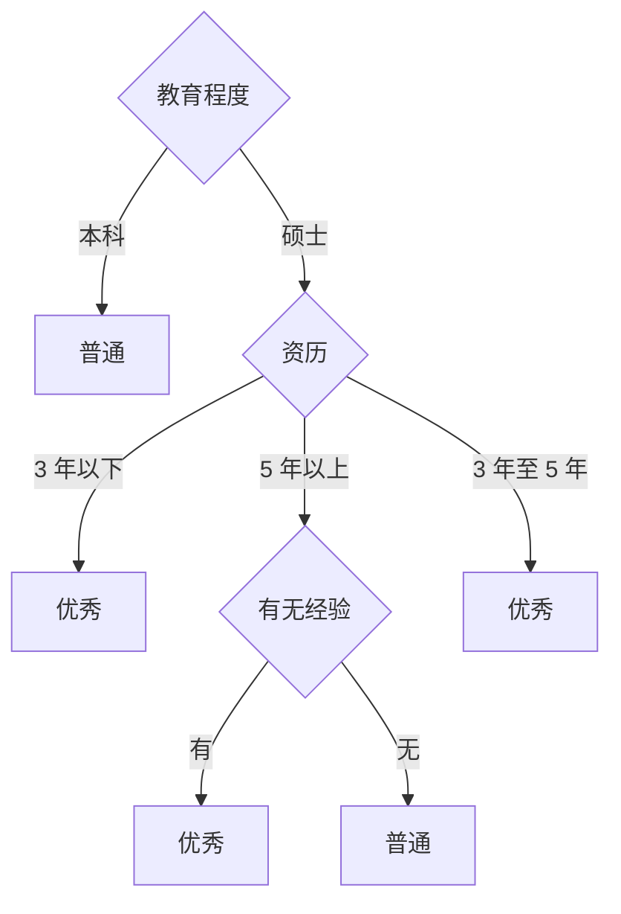

```mermaid
graph TD
A{教育程度}
    A --> | 本科 | B[普通]
    A --> | 硕士 | C{资历}
    C --> | 3 年以下 | D[优秀]
    C --> | 5 年以上 | E{有无经验}
    C --> | 3 年至 5 年| F[优秀]
    E --> | 有 | G[优秀]
    E --> | 无 | H[普通]
```
